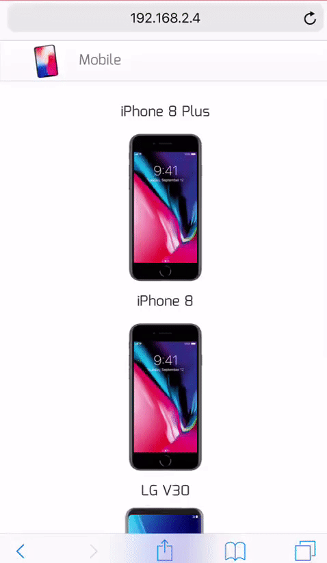
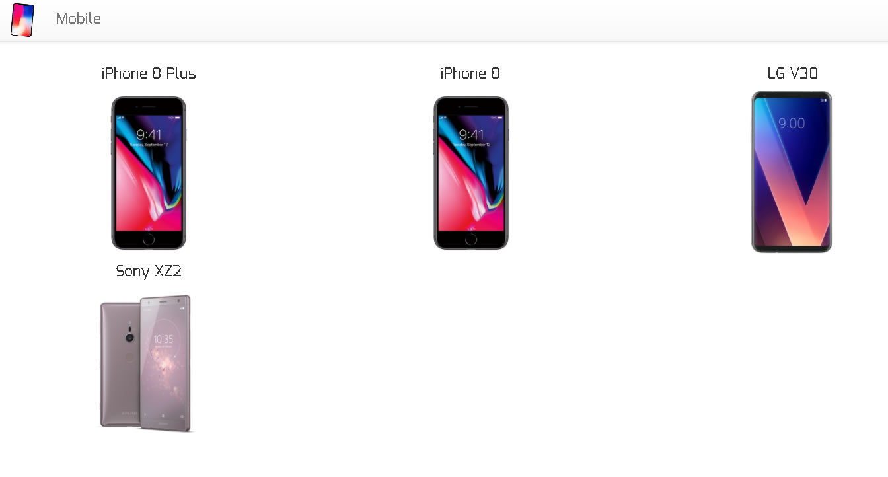
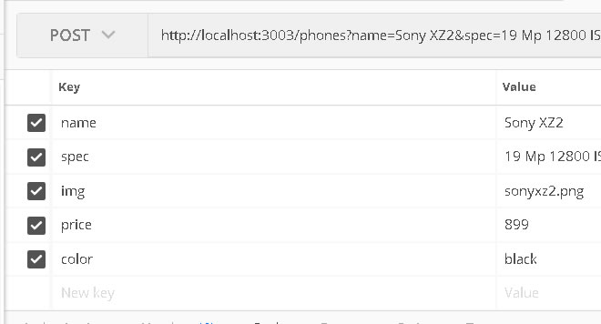

## APIP MOBILE app

## Install
- Clone repo
- Install
- Start

```
git clone https://aalexx1978@bitbucket.org/aalexx1978/apip2.git
cd apip
npm install
npm start
```

Check *nodemon* and *concurrently* are installed, they are used to start API and App.

```
"start": "concurrently --kill-others \"nodemon ./server.js\" \"react-scripts start\"",
```

On start error, install npm packages mentioned.

```
npm install --save concurrently nodemon
```




This application has 2 parts:
- Node Express API
- React / Redux Application

### Node Express API

API with GET, POST, PUT and DELETE functions, starts on 3003 port, **phones/** route.




MongoDB data are stored in a MLab **sandbox** https://mlab.com/databases/testapi/


## App

When the app starts, using **Axios** will get data from API.
Initial State:  

```
    phones: [],
    modal: false,
    detail: null,
    error: false,
    msg:null
```
  
Will be modified by **REDUX**

- **FETCH_DATA:** fetchs data.
- **RECEIVE_DATA:** gets data ok and sends them to the state.
- **SHOW_MODAL:** Show modal, sending **false** param, hides it.
- **MSG:** If there is an error, shows message.

